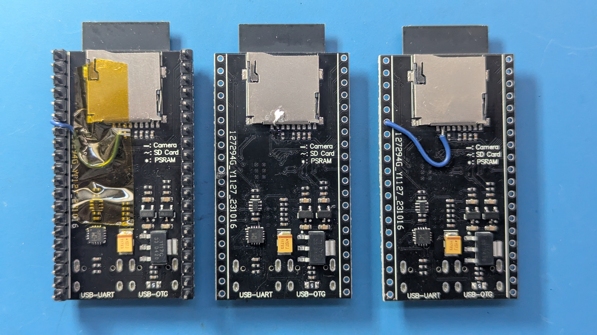

# ESP32-S3 SDCard OV2640 CAM devboard

ESP32-S3 WROOM N16R8 CAM Development Board WiFi+ Bluetooth-compatible Module OV2640/5640 Camera

# Reference

- https://documentation.espressif.com/esp32-s3-wroom-1_wroom-1u_datasheet_en.pdf

# SDCard fix

SDCard `CS` (pin 2) must be pulled low.

- You can tie `CS` permanently to ground (middle example)
- Or, you can connect `CS` to a GPIO pin (left/right shows connection to `IO41`)

# Install Micropython with OV2640 camera module support

1. Download the latest `*ESP32_GENERIC_S3-SPIRAM_OCT.zip` from
   https://github.com/cnadler86/micropython-camera-API/releases

1. Flash the `*.bin` file using [ESPConnect](https://thelastoutpostworkshop.github.io/ESPConnect/),
   or your preferred tool of choice

# Testing the camera

1. Connect the `UART` USB-C connector to your computer

1. Open a serial connection. Use any serial monitor you like, for example:
   - VS Code: https://marketplace.visualstudio.com/items?itemName=ms-vscode.vscode-serial-monitor
   - macOS: `screen -fa /dev/cu.usbmodem* 115200`

3. Press 'ENTER' to confirm the `>>>` Micropython REPL prompt

4. Update configuration data for your board:
   - Update `paste-wifi-json.py`
   - Update `paste-config-json.py`

5. Write config fiels to flash. To avoid buffer overrun, you might need to throttle
   the paste or paste in sections.
   - Paste `paste-wifi-json.py` into the REPL.
   - Paste `paste-config-json.py` into the REPL.

6. (Optionally) verify config files using `paste-open-file-read.py`

7. Paste `paste-simplewebcam.py` into the REPL.

8. Wait for the server to connect to your Wi-Fi and print the IP address to connect to.

9. Use your browser to connect to the IP address listed.

